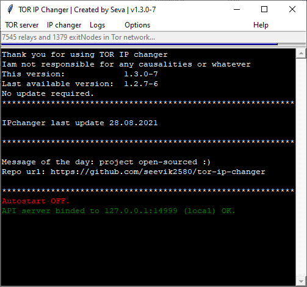
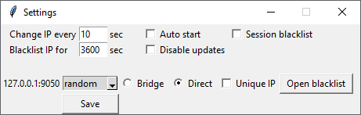
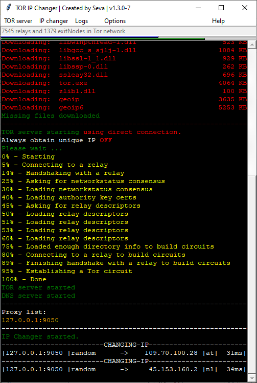
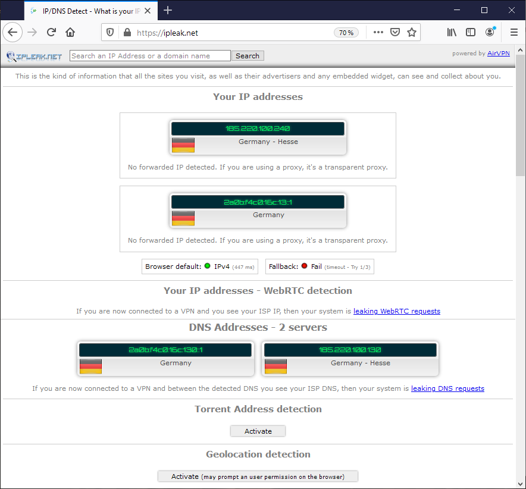
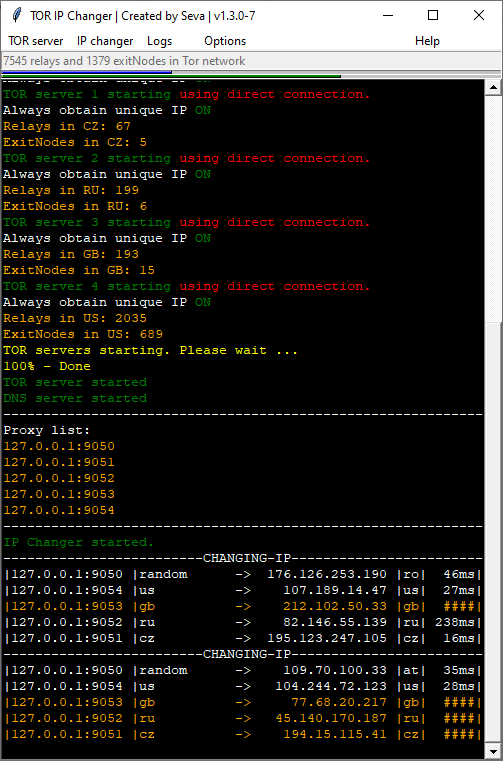

# tor-ip-changer
- request new identity every X seconds interval using TOR client

[](https://github.com/seevik2580/tor-ip-changer/graphs/commit-activity)
[](https://hits.seeyoufarm.com)

##### TOR IP Changer does not override router ip, it just create proxy which is connected inside TOR network which you can use to hide your real ip address for browser or apps that supports socks4/5 type proxy, and you can change that IP inside TOR network every X seconds. For most cases its just for browsers, but you can use third party software to co-operate with TOR IPchanger to anonymize not just browsers but also other apps which does not have support for socks4/5 type proxy or even whole computer with software like [Proxifier](https://www.proxifier.com/).

## i will take no responsibility !!! it is for educational purposes only

## Donation
- If you find this project interesting, you can send some Bitcoins to address: `1DkStuanmQLC9Xv4UgxbHRzhHqDwABkLfi`

# binaries: 
- windows [1.3.0 exe](https://github.com/seevik2580/tor-ip-changer/raw/master/dist/updater.exe) | [virustotal.com](https://www.virustotal.com/gui/file/1c8039d46508d48ce5edc1c7137a022962053f0b05450c4fe87a7321d3bafbf6/detection)
- windows [1.3.0 rar](https://github.com/seevik2580/tor-ip-changer/raw/master/dist/1.3.0/ipchanger.rar) | [virustotal.com](https://www.virustotal.com/gui/file/8689b3fbf95bc1db9ddd14a3a1fd99fbf972e88e1f80634d2d2ee53a3de08a6e/detection)
- mac     [1.0.0](https://github.com/seevik2580/tor-ip-changer/raw/master/mac/dist/1.0.0/IPchanger.dmg) ! discontinued, experimental ! tested on El Capitan 10.11.5

# source code:
- windows / linux   [1.3.0](https://github.com/seevik2580/tor-ip-changer/tree/master/source-code)
- mac     [1.0.0](https://github.com/seevik2580/tor-ip-changer/tree/master/source-code-mac)

# Docker
- windows / linux   [1.3.0](https://github.com/seevik2580/tor-ip-changer/blob/master/Dockerfile)
- [hub.docker.com](https://hub.docker.com/r/seevik2580/tor-ip-changer)
- run `xhost +` before starting container
- `docker run -p 14999:14999 -p 9050:9050 -e DISPLAY=$DISPLAY -v /tmp/.X11-unix:/tmp/.X11-unix seevik2580/tor-ip-changer`

# Docker-compose:
- windows / linux   [1.3.0](https://github.com/seevik2580/tor-ip-changer/tree/master/docker-compose.yml)
- run `xhost +` before starting container
- `docker-compose up -d`

# example of usage:







```
   1. click TOR server > Start
   2(optional) Options > Settings
   3. set your proxy inside browser or app to SOCKS4/5 127.0.0.1:9050 
      or list generated after start (only if multiproxy) 
   4. click IP Changer > Start
   5. go to http://checkip.amazonaws.com/ or http://showip.net/ or whenever it shows you IP, and after next period (default 10 seconds) refresh page and if it works, you will always see different IP

```


   
# *************************shortcuts**************************
```
usage: ipchanger.exe [-a AUTO] [-d] [-m 1-100] [-p] [-c COUNTRY] [-b] [-n] [-u]
    '-a n' automaticaly change ip after start every n
            example:   ipchanger.exe -a 35
                        change ip auto every 35 sec

    '-m n' start multiple proxy n instances
            example:   ipchanger.exe -m 5
                        start proxy 5 times
                        with different ports
                        and generate list

    '-d' open debug console live log

    '-c COUNTRYCODE' select specific country
    
    '-p' bind API to public IP

    '-b' use bridges by default

    '-n' disable check for updates

    '-u' always obtain unique ip

    '-g | --nogui' run without GUI, control through API
            to run in background use `nohup ipchanger -g &`
            for linux version
```




*****************************API****************************
```
  in default settings
  telnet 127.0.0.1 14999
  if you create shortcut with option -p | --publicAPI then
  telnet computerIP/publicIP 14999
  *******************************************
  help              | print usage
  tor start         | start tor server
  tor stop          | stop tor server
  interval N        | set interval to N seconds
  blacklist N       | set blacklist for N seconds
  uniqueip port N   | set On/Off to obtain unique ip for port
  changeip start    | start autochanging ip
  changeip stop     | stop autochanging ip
  changeip once     | just change once
  changeip onceport N | just change once for specific port
  exit              | close connection
  *******************************************
```  
  - API can be used with any language which support telnet
  - example API usage with python:
```  
      import telnetlib
      tn = telnetlib.Telnet('127.0.0.1', '14999', 5)
      tn.write(b"changeip once\r\n")
      tn.close
```      
  - example API usage with bash:
```  
      #!/bin/bash
      echo "changeip once" | telnet 127.0.0.1 14999
```   
  - example API usage with PHP:
```
      <?
      $host = "localhost";
      $port = "14999";
      $timeout = "5";
      $f=fsockopen($host,$port,$timeout);
      if (!$f) {
              echo "not connected";
      } else {
              echo "connected<br>";

              echo fgets($f, 1024);
              fwrite($f,"tor start\r\n");
              sleep(30);
              fwrite($f,"interval 30\r\n");
              sleep(1);
              fwrite($f,"changeip start\r\n");
              sleep(1);
              fwrite($f,"exit\r\n");
              echo fgets($f, 1024);
               fclose($f);
      }
      ?>
```
**************************Bridges***************************  
edit Tor/bridges.txt to insert your obfs bridges.
if not changed then default will be downloaded from github

***********************Country codes************************
```
(not all may works)                               
ASCENSION ISLAND                      {ac}
AFGHANISTAN                           {af}
ALAND                                 {ax}
ALBANIA                               {al}
ALGERIA                               {dz}
ANDORRA                               {ad}
ANGOLA                                {ao}
ANGUILLA                              {ai}
ANTARCTICA                            {aq}
ANTIGUA AND BARBUDA                   {ag}
ARGENTINA REPUBLIC                    {ar}
ARMENIA                               {am}
ARUBA                                 {aw}
AUSTRALIA                             {au}
AUSTRIA                               {at}
AZERBAIJAN                            {az}
BAHAMAS                               {bs}
BAHRAIN                               {bh}
BANGLADESH                            {bd}
BARBADOS                              {bb}
BELARUS                               {by}
BELGIUM                               {be}
BELIZE                                {bz}
BENIN                                 {bj}
BERMUDA                               {bm}
BHUTAN                                {bt}
BOLIVIA                               {bo}
BOSNIA AND HERZEGOVINA                {ba}
BOTSWANA                              {bw}
BOUVET ISLAND                         {bv}
BRAZIL                                {br}
BRITISH INDIAN OCEAN TERR             {io}
BRITISH VIRGIN ISLANDS                {vg}
BRUNEI DARUSSALAM                     {bn}
BULGARIA                              {bg}
BURKINA FASO                          {bf}
BURUNDI                               {bi}
CAMBODIA                              {kh}
CAMEROON                              {cm}
CANADA                                {ca}
CAPE VERDE                            {cv}
CAYMAN ISLANDS                        {ky}
CENTRAL AFRICAN REPUBLIC              {cf}
CHAD                                  {td}
CHILE                                 {cl}
PEOPLE'S REPUBLIC OF CHINA            {cn}
CHRISTMAS ISLANDS                     {cx}
COCOS ISLANDS                         {cc}
COLOMBIA                              {co}
COMORAS                               {km}
CONGO                                 {cg}
CONGO (DEMOCRATIC REPUBLIC)           {cd}
COOK ISLANDS                          {ck}
COSTA RICA                            {cr}
COTE D IVOIRE                         {ci}
CROATIA                               {hr}
CUBA                                  {cu}
CYPRUS                                {cy}
CZECH REPUBLIC                        {cz}
DENMARK                               {dk}
DJIBOUTI                              {dj}
DOMINICA                              {dm}
DOMINICAN REPUBLIC                    {do}
EAST TIMOR                            {tp}
ECUADOR                               {ec}
EGYPT                                 {eg}
EL SALVADOR                           {sv}
EQUATORIAL GUINEA                     {gq}
ESTONIA                               {ee}
ETHIOPIA                              {et}
FALKLAND ISLANDS                      {fk}
FAROE ISLANDS                         {fo}
FIJI                                  {fj}
FINLAND                               {fi}
FRANCE                                {fr}
FRANCE METROPOLITAN                   {fx}
FRENCH GUIANA                         {gf}
FRENCH POLYNESIA                      {pf}
FRENCH SOUTHERN TERRITORIES           {tf}
GABON                                 {ga}
GAMBIA                                {gm}
GEORGIA                               {ge}
GERMANY                               {de}
GHANA                                 {gh}
GIBRALTER                             {gi}
GREECE                                {gr}
GREENLAND                             {gl}
GRENADA                               {gd}
GUADELOUPE                            {gp}
GUAM                                  {gu}
GUATEMALA                             {gt}
GUINEA                                {gn}
GUINEA-BISSAU                         {gw}
GUYANA                                {gy}
HAITI                                 {ht}
HEARD &amp; MCDONALD ISLAND           {hm}
HONDURAS                              {hn}
HONG KONG                             {hk}
HUNGARY                               {hu}
ICELAND                               {is}
INDIA                                 {in}
INDONESIA                             {id}
IRAN, ISLAMIC REPUBLIC OF             {ir}
IRAQ                                  {iq}
IRELAND                               {ie}
ISLE OF MAN                           {im}
ISRAEL                                {il}
ITALY                                 {it}
JAMAICA                               {jm}
JAPAN                                 {jp}
JORDAN                                {jo}
KAZAKHSTAN                            {kz}
KENYA                                 {ke}
KIRIBATI                              {ki}
KOREA, DEM. PEOPLES REP OF            {kp}
KOREA, REPUBLIC OF                    {kr}
KUWAIT                                {kw}
KYRGYZSTAN                            {kg}
LAO PEOPLE'S DEM. REPUBLIC            {la}
LATVIA                                {lv}
LEBANON                               {lb}
LESOTHO                               {ls}
LIBERIA                               {lr}
LIBYAN ARAB JAMAHIRIYA                {ly}
LIECHTENSTEIN                         {li}
LITHUANIA                             {lt}
LUXEMBOURG                            {lu}
MACAO                                 {mo}
MACEDONIA                             {mk}
MADAGASCAR                            {mg}
MALAWI                                {mw}
MALAYSIA                              {my}
MALDIVES                              {mv}
MALI                                  {ml}
MALTA                                 {mt}
MARSHALL ISLANDS                      {mh}
MARTINIQUE                            {mq}
MAURITANIA                            {mr}
MAURITIUS                             {mu}
MAYOTTE                               {yt}
MEXICO                                {mx}
MICRONESIA                            {fm}
MOLDAVA REPUBLIC OF                   {md}
MONACO                                {mc}
MONGOLIA                              {mn}
MONTENEGRO                            {me}
MONTSERRAT                            {ms}
MOROCCO                               {ma}
MOZAMBIQUE                            {mz}
MYANMAR                               {mm}
NAMIBIA                               {na}
NAURU                                 {nr}
NEPAL                                 {np}
NETHERLANDS ANTILLES                  {an}
NETHERLANDS, THE                      {nl}
NEW CALEDONIA                         {nc}
NEW ZEALAND                           {nz}
NICARAGUA                             {ni}
NIGER                                 {ne}
NIGERIA                               {ng}
NIUE                                  {nu}
NORFOLK ISLAND                        {nf}
NORTHERN MARIANA ISLANDS              {mp}
NORWAY                                {no}
OMAN                                  {om}
PAKISTAN                              {pk}
PALAU                                 {pw}
PALESTINE                             {ps}
PANAMA                                {pa}
PAPUA NEW GUINEA                      {pg}
PARAGUAY                              {py}
PERU                                  {pe}
PHILIPPINES (REPUBLIC OF THE)         {ph}
PITCAIRN                              {pn}
POLAND                                {pl}
PORTUGAL                              {pt}
PUERTO RICO                           {pr}
QATAR                                 {qa}
REUNION                               {re}
ROMANIA                               {ro}
RUSSIAN FEDERATION                    {ru}
RWANDA                                {rw}
SAMOA                                 {ws}
SAN MARINO                            {sm}
SAO TOME/PRINCIPE                     {st}
SAUDI ARABIA                          {sa}
SCOTLAND                              {uk}
SENEGAL                               {sn}
SERBIA                                {rs}
SEYCHELLES                            {sc}
SIERRA LEONE                          {sl}
SINGAPORE                             {sg}
SLOVAKIA                              {sk}
SLOVENIA                              {si}
SOLOMON ISLANDS                       {sb}
SOMALIA                               {so}
SOMOA,GILBERT,ELLICE ISLANDS          {as}
SOUTH AFRICA                          {za}
SOUTH GEORGIA, SOUTH SANDWICH ISLANDS {gs}
SOVIET UNION                          {su}
SPAIN                                 {es}
SRI LANKA                             {lk}
ST. HELENA                            {sh}
ST. KITTS AND NEVIS                   {kn}
ST. LUCIA                             {lc}
ST. PIERRE AND MIQUELON               {pm}
ST. VINCENT &amp; THE GRENADINES      {vc}
SUDAN                                 {sd}
SURINAME                              {sr}
SVALBARD AND JAN MAYEN                {sj}
SWAZILAND                             {sz}
SWEDEN                                {se}
SWITZERLAND                           {ch}
SYRIAN ARAB REPUBLIC                  {sy}
TAIWAN                                {tw}
TAJIKISTAN                            {tj}
TANZANIA, UNITED REPUBLIC OF          {tz}
THAILAND                              {th}
TOGO                                  {tg}
TOKELAU                               {tk}
TONGA                                 {to}
TRINIDAD AND TOBAGO                   {tt}
TUNISIA                               {tn}
TURKEY                                {tr}
TURKMENISTAN                          {tm}
TURKS AND CALCOS ISLANDS              {tc}
TUVALU                                {tv}
UGANDA                                {ug}
UKRAINE                               {ua}
UNITED ARAB EMIRATES                  {ae}
UNITED KINGDOM (no new registrations) {gb}
UNITED KINGDOM                        {uk}
UNITED STATES                         {us}
UNITED STATES MINOR OUTL.IS.          {um}
URUGUAY                               {uy}
UZBEKISTAN                            {uz}
VANUATU                               {vu}
VATICAN CITY STATE                    {va}
VENEZUELA                             {ve}
VIET NAM                              {vn}
VIRGIN ISLANDS (USA)                  {vi}
WALLIS AND FUTUNA ISLANDS             {wf}
WESTERN SAHARA                        {eh}
YEMEN                                 {ye}
ZAMBIA                                {zm}
ZIMBABWE                              {zw}
```
